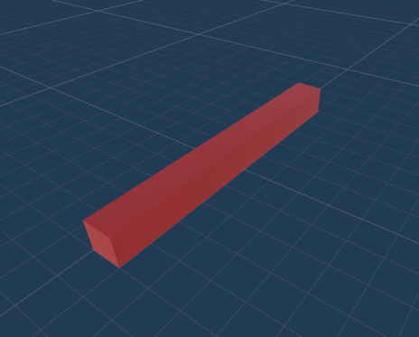

# Jumper AI - Marwan Benali s129511


- Set-up: An environment with two crossing planes with the Agent in the middle of the cross.
- Goal: The agent must jump over incoming obstacles (right image), coming from both sides.
 
 
- Agents: The environment contains three agents with the same Behavior
  Parameters.
- Agent Reward Function:
  - -0.2f if the agent jumps.
  - -10f if the agent hits the obstacle (episode ends).
  - +10.0 if the obstacle hits the wall after the agent jumps over it (episode ends).
- Behavior Parameters:
  - Vector Observation space: 1
  - Actions: 1 discrete action branch with 2 actions, corresponding to jumping or not moving.

## Prerequisites

### Windows
- Unity version: 2022.3.26f1
- ML Agents Unity Package: 2.0.1
- Anaconda
  - Environment with Python: 3.9.18
  - PyTorch: 1.7.1
  - Protobuf 3.20.*
  - ML Agents 0.30.0

## Installation
1. Clone this project onto your PC
2. Add this project to Unity Hub and open it
3. In Unity, click on Window > Package Manager
4. Click on "Packages: In Project" and choose Unity Registry
5. Search for "ML Agents" and press install (recommended version 2.0.1)
6. In the Project Explorer, click on Scenes and open Scene_Jumper
7. To test out the pretrained Model, press "Play".
### Training new model:
1. Open Anaconda Prompt
2. Activate environment with Python version 3.9.18
3. Navigate in Anaconda Prompt to the Unity Project's root folder (Containing Assets & config folders)
4. Start the learning progress with this command:
    
    ```bash
    mlagents-learn config/jumper.yaml --run-id=JumperAgent
    ```
5. In Unity, press "Play". If you see the Agents jumping way faster than usual, then the training progress has begun.
6. In another Anaconda Prompt window, following step 2 & 3, use the following command to view Tensorboard:
 
    ```bash
    tensorboard --logdir results
    ```

## Tensorboard Training Results
These are the results from training the Agent, resulting in the Jumper.onnx model file.

As you can see, the Environment/Cumulative Reward graph shows an immediate uptick in rewards collected after 100k. While training, I myself have observed that the Agent was dodging the incoming obstacles better and better the longer it trained. The Value loss drops down significantly too.
Interestingly enough, around 700k you can see a huge dive in rewards collected. This is because the Agent was trying out new ways of collecting more rewards, which ended up backfiring. After noticing it, the AI went back optimizing its best tactic.

The average Episode length gets longer the longer I train, which shows that the Agent is getting better at dodging the obstacle, as it takes longer for the obstacle to hit the wall than to hit the Agent.


#
